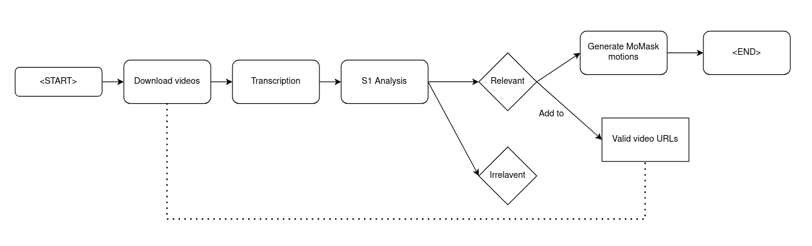

# PSC Server Code

This repo contains the code we execute on the PSC server to obtain animation data for humanoid robot farming.

## Quick Start

### Setup

### For Whisper
You should create a conda environment called whisper. This is optional, but the SLURM batch jobs provided use this environment.

	conda create -n whisper python=3.12
	conda activate whisper

You will need yt-dlp:

	python3 -m pip install -U "yt-dlp[default]"

You will also need whisper, which will convert audio to transcripts:

	pip install -U openai-whisper

Finally, you will need ffmpeg:

	conda install conda-forge::ffmpeg

There is a text file called videos.txt in the video_processing folder. Paste YouTube links separated by a newline into this text folder for videos you wish to download.

### For S1

Now you need to create an environment for S1.

	cd s1_baseline/
	conda create -n s1
	pip install -r requirements.txt

You will also need an S1 model. You can either git clone a model from [the S1 repo](https://huggingface.co/simplescaling), or run a bash download script in s1_baseline/ folder. Make sure the model folder is saved in the s1_baseline/ folder.

### For MoMask

Finally, create an environment for MoMask.

	cd momask_baseline/
	conda env create -f environment.yml
	conda activate momask
	pip install git+https://github.com/openai/CLIP.git
	bash prepare/download_models.sh	

### Getting Dataset

Once you have the dependencies installed, you can run batchvideos.slurm in the video_processing folder:

	sbatch batchvideos.slurm

This will submit a job that will download the YouTube videos (stored in rawvideos), extract the audio, and then generate text transcripts of the videos (stored in transcripts), as well as a .csv file called video_data.csv in video_processing/output/

### Generating Tasks

Once you have all the videos downloaded and transcribed you can generate tasks to be generated in MoMask. Go to the s1_baseline/ folder, and run:

	conda activate s1
	python s1.py --model <model name> --gpus <# of gpus to use> --tokens <max tokens>

For example:

	python s1.py --model s1.1-32B --gpus 4 --tokens 32768

This will generate a .json file, s1_baseline/output/output.json that stores a list of videos, their information, and a nested list of tasks and subtasks for each video. Each video will be accepted/rejected, and only accepted videos will have their tasks saved. Rejected videos will have their urls saved in video_processing/blacklist.txt. Accepted videos will be copied over to video_processing/relevant_videos/.

### Generating Motions

Once the tasks are generated, navigate to the momask_baseline/ folder, and run:

	conda activate momask
	generate_motions.py

The outputs are stored in momask_baseline/generation/batch_motions/

## Workflow

START -> batch video download (video_id.mp3) -> Whisper transcription -> S1 Analysis (tasks/reject) -> MoMask Motion Generation -> END
S1 Analysis -> Generate a text file of urls that were not rejected for being irrelevant.
