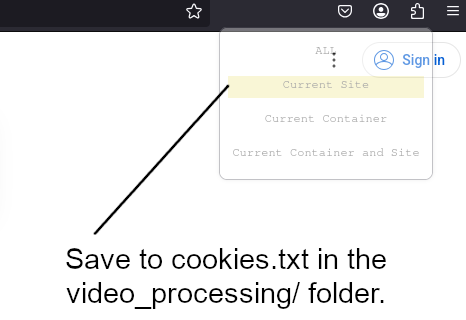

# PSC Server Code

This repo contains the code we execute on the PSC server to obtain animation data for humanoid robot farming.

## Quick Start

### Main Scripts.

To run the motion generation jobs, run:

	bash generate_all.sh

There are also two scrips in the root of the repo:

	generate_motions.slurm
	setup.sh

Running setup.sh will set up all the conda environments and dependencies. Running generate_motions.slurm will then run the entire workflow of transcribing videos, accepting transcripts, and generating motion files. You need to download videos first into video_processing/rawvideos/ first. See the section getting datasets. To run just one job of generate_motions:

	sbatch generate_motions.slurm <start> <end>

Where start is the number to start from and end is to the number to end at in terms of the amount of videos in video_processing/rawvideos. To run all the videos simply do:

	sbatch generate_motions.slurm 0 -1

### Setup

### For Whisper

You should create a conda environment called whisper. This is optional, but the SLURM batch jobs provided use this environment.

	conda create -n whisper python=3.12
	conda activate whisper

You will need yt-dlp:

	python3 -m pip install -U "yt-dlp[default]"

You will also need whisper, which will convert audio to transcripts:

	pip install -U openai-whisper

Finally, you will need ffmpeg:

	conda install conda-forge::ffmpeg

There is a text file called videos.txt in the video_processing folder. Paste YouTube links separated by a newline into this text folder for videos you wish to download.

### For S1

Now you need to create an environment for S1.

	cd s1_baseline/
	conda create -n s1
	pip install -r requirements.txt

You will also need an S1 model. You can either git clone a model from [the S1 repo](https://huggingface.co/simplescaling), or run a bash download script in s1_baseline/ folder. Make sure the model folder is saved in the s1_baseline/ folder.

### For MoMask

Finally, create an environment for MoMask.

	cd momask_baseline/
	conda env create -f environment.yml
	conda activate momask
	pip install git+https://github.com/openai/CLIP.git
	bash prepare/download_models.sh	

### For Depth Anything

You can also generate depth frames (pictures of 3d depth) from the relevant videos. Set up the environment:

	cd depth_anything_baseline/
	conda create -n depthanything
	conda activate depthanything
	pip install -r requirements.txt

### Getting Dataset

Step 1: Video Downloading: 

In order to gettting the dataset ready, we need to start from downloading creative commons videos from Youtube. 

Through this process, we need to execute the generation of search terms:

	python s1_baseline/generate_search_terms.py --model <model_folder_name> --gpus <gpu_count> --searches <amount_of_searches_to_generate> --tokens <token_count>

Next we will need to get URLs from these search terms:

	cd video_processing
	python youtube_search.py --input_file output/video_downloading/search_terms.txt --api_key <youtube_v3_api_key> --files <split_into_how_many_files> --max_urls <max_grabbed_urls>

This will generate text files containing a list of URLs in the video_processing/output/video_downloading/ folder, names videos_s1_<id>.txt. You will need a YouTube V3 API key. If you are part of Great Robotics Lab then we already have one. Keep in mind you only get about 1,000 video searches in the API quota, including checking for duplicate videos.
Next you will need to download the videos. It recommended to create a cookies.txt file in the video_processing/ directory. Then you will need to pass cookies to it.

Use a cookies extraction extension to paste them into this file. This is due to YouTube blocking mass downloads of videos. [Here is a link describing how to get the cookies file from the yt-dlp repo.](https://github.com/yt-dlp/yt-dlp/wiki/Extractors#exporting-youtube-cookies)

Essenetially, we need to do this. YouTube rotates account cookies frequently on open YouTube browser tabs as a security measure. To export cookies that will remain working with yt-dlp, you will need to export cookies in such a way that they are never rotated.

One way to do this is through a private browsing/incognito window:

Open a new private browsing/incognito window and log into YouTube

Open a new tab and close the YouTube tab

You need an extension for a browser, such as for firefox cookie management extenion (Get cookies.txt LOCALLY)

Export youtube.com cookies from the browser then close the private browsing/incognito window so the session is never opened in the browser again.

The cookies file needs to be under the video_processing folder.

After generation of these cookies, you can run batchvideos.slurm in the video_processing folder (note, this one will use both generated search terms and hardcoded links):

	sbatch batchvideos.slurm <url_file_number>

This will submit a job that will download the YouTube videos (stored in rawvideos), extract the audio, and then generate text transcripts of the videos (stored in transcripts), as well as a .csv file called video_data.csv in video_processing/output/

On Local Server, you can do the following to download videos.

	bash local_server_script/batchvideos.sh <url_file_number>

The url_file_number argument refers to the number of the videos_s1 text file generated by generate_search_terms.py. You can put an asterisk (*) to download all the files made by generate_search_terms.py.

The downloaded videos will be saved to video_processing/rawvideos/
The script will then attempt to identify and transcribe the videos. If this fails, the videos will still be saved.

Step 2: Depth-anythingv2 data generation 

You can now generate depth frames from the videos. Navigate to depth_anything_baseline/scripts/ and run either:

	bash generate_all.sh
or
	sbatch generate_depths.slurm <start> <end>

for PSC, or

	conda activate depthanything
	python Video_YTB_text.py --start <start> --end <end>

The <start> and <end> parameters determine the range of files to process. For instance, 0 and 100 will process the first 100 files. The raw frames will be saved in video_processing/output/ and the depth frames will be saved in depth_anything_baseline/output/

### Generating Tasks

Once you have all the videos downloaded and transcribed you can generate tasks to be generated in MoMask. Go to the s1_baseline/ folder, and run:

	conda activate s1
	python s1.py --model <model name> --gpus <# of gpus to use> --tokens <max tokens>

For example:

	python s1.py --model s1.1-32B --gpus 4 --tokens 32768

This will generate a .json file, s1_baseline/output/output.json that stores a list of videos, their information, and a nested list of tasks and subtasks for each video. Each video will be accepted/rejected, and only accepted videos will have their tasks saved. Rejected videos will have their urls saved in video_processing/blacklist.txt. Accepted videos will be copied over to video_processing/relevant_videos/.

### Generating Motions

Once the tasks are generated, navigate to the momask_baseline/ folder, and run:

	conda activate momask
	generate_motions.py

The outputs are stored in momask_baseline/generation/batch_motions/

## Workflow of the Project

START -> batch video download (video_id.mp3) -> Whisper transcription -> S1 Analysis (tasks/reject) -> MoMask Motion Generation -> END
S1 Analysis -> Generate a text file of urls that were not rejected for being irrelevant.

## Important File Creation/Generation Process

List of tasks and subtasks for each video, generated by s1_baseline/s1.py

	PSCserverCode/s1_baseline/output/output.json

Data file that references a video's id to its name and category, can be used to find the name of a .mp4 file based on its id. Generated by video_processing/identify_videos.py

	PSCserverCode/video_processing/output/video_data.csv

Same as above, but only for relevant videos. Generated by s1_baseline/s1.py. However, this file also contains a column for the reason that the video was accepted as relevant.

	PSCserverCode/video_processing/relevant_videos/video_data.csv

List of rejected video urls, followed by a comma and the reason the video was rejected. Generated by s1_baseline/s1.py

	PSCserverCode/video_processing/blacklist.txt

## Interactive Session on PSC Cluster and MTSU Cluster

Interactive sessions allow the user to use GPU resources in real time, akin to just using terminal on a computer that has gpus and CUDA installed.

### PSC Cluster

To run an interactive session:

	interact -p <partition> --gres=gpu:<gpu name>:<gpu count> -t <time in HH:MM:SS>

For example, to run 4 gpus each with 32G of VRAM for 1 hour:

	interact -p GPU-shared --gres=gpu:v100-32:4 -t 01:00:00

### MTSU Cluster

To run an interative session:

	srun --partition interactive --gres=gpu:<gpu name>:<gpu count> --ntasks=1 --time <time in HH:MM:SS> --pty bash

For example, to run a 2080Ti for 1 hour:

	srun --partition interactive --gres=gpu:2080Ti:1 --ntasks=1 --time 01:00:00 --pty bash

